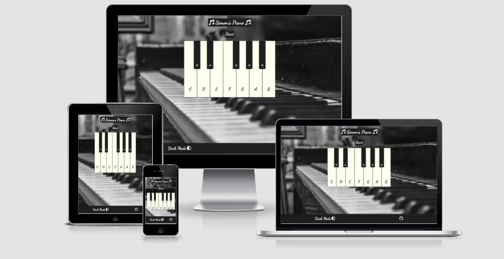
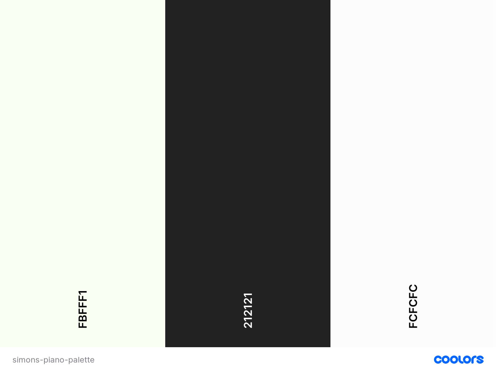

# Simon's Piano

View live site [*here*](https://yusuffrih.github.io/Simons-Piano-Game/)

Simon's Piano is a web page that provides the user with a fun game to play. The game takes it's inspiration from the original Simon game but with it's own twist on it, the twist being that it's played through a piano keyboard. When the keys are pressed, they make a sound which represents a note on the piano.

The game is primarily about providing the user with a fun time, but it has other goals. It aims to inspire people to begin playing music, whether that is piano, guitar or any other instrument. Through playing the game, people will hopefully realise that they can easily learn to play a couple of songs which might start them on their inspired journey to learning to play an instrument. 

Simon's Piano aims to be a really simple game and web-page overall that doesn't take any time or skill to start playing. I hope you enjoy!

## Table of Contents
* User Experience (UX)
    * Site Owner Goals
    * User Goals
    * User Stories
    * User Requirements
    * User Expectations
    * Design Choices
        * Fonts
        * Colours
        * Icons
* Wireframes
* Features
    * Implemented Features
    * Features Not Yet Implemented
* Technologies Used
* Testing
* Bugs
* Deployment
* Credits
* Final Comments

## User Experience (UX)

### Site Owner Goals
* I want to inspire people to play music
* I want to give the users of my site a positive experience with a game that evokes positive emotions
* I want to have a visually appealing website
* I want the users to feel like they are testing their short-term memory and attention span
* I want the users to be able to toggle between light and dark mode on the page
* I want the user to be given feedback for their interactions with the page

### User Goals
* To have fun while playing the game
* For the game to be responsive so that I can play on various devices
* To feel like my short-term memory is being challenged 
* To be able to see my score throughout the duration of the game 
* To be told how far I've got when I lose the game
* To be given feedback based on my choices - interactivity
* To be able to change the colour theme of page when playing the game
* To be able to give the site owner some feedback so that they could improve the game and fix any bugs that may arise.

### User Stories
* As a user, I would like to be able to choose when I start the game so that I am in control
* As a user, I would like to track my score throughout the game
* As a user, I would like to be able to access a variety of difficulties based on my skill level
* As a user I would like the game to have some element of variety in the game play so that I don't get bored. 
* As a user, I would like to be given some positive/negative feedback when I pass/fail a level of the game
* As a user, I would like to be able to see the game developer’s Github page to see if they have any other cool games to play
* As a user, I would like to be able to pick a colour theme for the website
* As a user, I would like to be able to give the game designer some feedback on how to improve the game features

### User Requirements
* The site needs to be easy to navigate between the different features via good UX
* To be able to press play to start the game when the user is ready
* To have a landing page that tells the user what the page is at a glance
* To have a well laid out page that is easy to use and understandable
* To be able to read clearly any messaging that is displayed on screen - constrasting backgrounds
* To be given clear and easy to understand instructions
* To get feedback from the game when I win or lose in a level
* To be able to see the score throughout the game 

### Design Choices
To keep the game nice and simple for the user, I decided to keep the colour scheme basic. The user’s attention should be drawn to the game area as soon as possible with no confusion about what the aim of the game is. To achieve this, the game area is going to be placed in the middle of the screen with a contrasting background colour. 

#### Fonts: 
There is very little text on the landing page so as not to distract the user and not to take attention away from the game area. For the fonts, I decided to go to [Google Fonts](https://fonts.google.com/?standard-styles=) which is great for getting any kind of font you want. The fonts I chose for my page are *Dancing Script* & *Lato* with *sans-serif* as a backup font in the event that Google Fonts does not work. The reason I decided to use *Dancing Script* is that it is quiet a beautiful, artistic font which would almost represent the art of a piano and music. 

#### Colours:
When deciding what colour scheme to choose for my project, I decided to keep it really simple with a black and white colour scheme to be similar to the colours of a piano. This has the effect of being simple yet sleek and visually appealing. And, of course when choosing the colours of the white piano keys, I had to choose ivory over white. 

I used [Coolors](https://coolors.co/) to generate a colour scheme for the site. This is a really cool site that randomly generates colour schemes. You can keep generating new colour schemes until you find ones that fits your requirements. The site provides you with the [Hex value](https://en.wikipedia.org/wiki/Hexadecimal) of the colours so you can just copy and paste it into your code. See below for my choice of colour scheme. 

There were two different colour schemes the user could chose to toggle between. The colours used in each are as follows: 
#### Dark
* Body Background: black and white - [darker image](assets/images/background/piano-dark-bg.jpg)
* Font Colours(Headings and body): #FCFCFC 
* Piano Keys: ##FBFFF1 - Ivory & #212121 - Black
* Buttons: #212121 - Black
* Footer: #212121 - Black

#### Light
* Body Background: black and white - [lighter image](assets/images/background/piano-light-bg.jpg)
* Font Colours(Headings and body): #212121 
* Piano Keys: ##FBFFF1 - Ivory & #212121 - Black
* Buttons: #FCFCFC - White
* Footer: #FCFCFC - White
* Footer Elements: #212121 - Black 

#### Icons
I used some music icons to the heading to add some design to the page and keep with the music theme. 

I used two icons in the footer. One for the Github logo & one for the dark mode logo.

I got the icons from [Font Awesome](https://fontawesome.com/) which is a great website for all your icon needs. I feel that the icons just add a little bit of extra style to the page and make it overall a bit more visually appealing. 

## Wireframes

When creating my wireframes, I first drew some rough sketches on paper but then decided that [Balsamiq](https://balsamiq.com/) would be the most suitable technology to use to assist with the design of the game. 

I created mock ups for my page to fit into the main device types - Desktop, Tablet and Mobile. In my mock-ups, I had envisaged there being one single page for the project with a pop-up form for EmailJS where the user could provide feedback. 

* [Desktop](wireframes/desktop-simons-piano-pame.png)
* [Tablet](wireframes/tablet-simons-piano-game.png)
* [Mobile](wireframes/mobile-simons-piano-game.png)

## Features 
### Implemented Features
* Title/heading sections at the top of the page
* Start button to begin the game
* Score area outlining the score and the level the user has reached
* Interactive black and white piano keys
* Musical audio notes attached to the corresponding piano keys
* Footer which provides the user a link to the site owners Github profile
* A responsive design that accomodates multiple devices
* The ability to play the game with the keyboard to give the player more of an authentic piano feeling
* Instructions for what keys to use to play the piano keys
* Feedback on how the player is doing - levels are tallied and displayed 
* Button feedback for every button pressed or click they make through audio and visual
* A button to enable the user to pick a colour theme for the website e.g. dark/light 

### Features Yet To Be Implemented 
* Feedback form operating through Email.js which provides the user with a personalised & automatic response to let them know that their feedback has been received - Cold not implement this feature due to time constraints
* Have actual songs played through the piano for the user to attempt to repeat as a different game mode. This would give the user some variety and constibute to achieving one of the project's goals of teaching the user to play music - Again, time constraints didn't allow for this to be implemented

## Technologies

### Languages
* [HTML 5](https://en.wikipedia.org/wiki/HTML) - HTML5 is a markup language I used for structuring and presenting content of my site
* [CSS3](https://en.wikipedia.org/wiki/CSS) - A language used to style the presentation of the content written in HTML5
* [Javascript](https://en.wikipedia.org/wiki/JavaScript) - Javascript is the language used to provide the interactivity to the user on the site.

### Frameworks & Libraries
* [Bootstrap](https://getbootstrap.com/docs/4.6/getting-started/introduction/) 4 - A front-end framework which assist me in creating responsive website design
* [Google Fonts](https://fonts.google.com/) - An open-source online library of thousands of fonts and icons that were free and easy to use.
* [Font Awesome](https://fontawesome.com/) - An open source online library of icons which I used for extra styling.
* [Pexels](https://www.pexels.com/) - Online library of stock photos for use for free.

### Tools
* [Coolors](https://coolors.co/) - Used this to generate a colour scheme that matched what I wanted for the site.
* [Balsamic](https://balsamiq.com/) - Software used to complete the wireframes. This was much easier than trying to draw.
* [Git](https://en.wikipedia.org/wiki/Git) - System used version control.
* [GitHub](https://github.com/) - This is where my project repository was stored.
* [GitPod](https://www.gitpod.io/) - Open source, online workspace used to work on my project.
* [W3 HTML Validator](https://validator.w3.org/) - Used to validate my code to ensure that there were no errors.
* [W3 CSS Validator](https://jigsaw.w3.org/css-validator/) - Used to validate my code to ensure that there were no errors.
* [Chrome Dev Tools](https://developer.chrome.com/docs/devtools/Chrome) - A set of development tools to assist the user create web content. They are built directly into the browser
* [Lighthouse](https://chrome.google.com/webstore/detail/lighthouse/blipmdconlkpinefehnmjammfjpmpbjk?hl=en) - One of the Chrome Dev Tools which was used to assess the level of accessibility, performance and correctness that was provided by the site.
* [JS Fiddle](https://jsfiddle.net/) - An online playground IDE used to test and trial Javascript code with HTML and CSS
* [Youtube](https://www.youtube.com/) - Youtube videos are a great way to learn how to do different things if stuck on a particular piece of code

## Testing

### User Story Testing
* As a user, I would like to be able to choose when I start the game so that I am in control
    - When the user lands on the page, the game does not start automatically. The user gets a chance to consume what is displayed on screen and has to click on the start button above the piano keys to start the game. 

* As a user, I would like to track my score throughout the game
    - The user can keep track of their how they are doing throughout the game in the tally section which comes up on top of the piano keys throughout the game highlighting what level they are on. 

* As a user, I would like to be able to access a variety of difficulties based on my skill level
    - The further the user gets into the game, the harder it gets. The randomly generated note pattern builds on itself with each level making it more challenging. Each time the user starts a new game, they get a new randomly generated pattern to play with which

*  As a user I would like the game to have some element of variety in the game play so that I don't get bored. 
    - Each time the user starts a new game, they get a new randomly generated pattern to play with which should keep them entertained and which should keep challenging their memory

* As a user, I would like to be given some positive/negative feedback when I pass/fail a level of the game
    - The user is shown a message under they piano keys when they win a level saying 'Fair play Beethoven'. This lets them know that they've won the level. If they get to level 35 and win the game, an alert will display letting them know that they have won.
    - Every time the player loses, an alert is displayed on the screen to let them know that they have lost and to let them know what level in the game they got to

* As a user, I would like to be able to see the game developer’s Github page to see if they have any other cool games to play
    - The user is easily able to access the game site owner's GitHub profile in the footer of the page to see if they have any other interesting games there. This is also somewhere that the user can make contact with the developer

* As a user, I would like to be able to pick a colour theme for the website
    - The user will clearly see the labelled dark mode toggle in the footer of the page. If they click on this, they will see the colour scheme of the page change. This includes a lighter background image, different background colours and font colours. Of course, the piano elements of the page will remain the same colour however

* As a user, I would like to have some instructions on how to play the game made available to me at a click of a button
    - The game itself is extremely intuitive. However, there is a prompt that appears for the user that lets them know that it's their turn and letting them know how many taps of the piano keys they need to input. There are also instructions for the user letting them know how to use the keyboard keys to play the game if that's what they would prefer

* As a user, I would like to be able to give the game designer some feedback on how to improve the game features
    - The user will be able to provide the developer with some feedback on the game through the Github profile page

*Screenshots outlining the testing for the User Stories can be found [here](/workspace/Simons-Piano-Game/assets/images/readme-imgs/user-story-testing-images).*

### Validator Testing
#### HTML Validator
* Errors:
    - No errors found
* Fixes:
    - N/A 

#### CSS Validator
* Errors:
    - No errors found
* Fixes:
    - N/A

### Feature Testing 
* Title/heading sections at the top of the page
    - Header of the page is displayed at the top of the page does not get distorted at any screen size. I have added some icons to the page header to add some style and provide nice UI 
* Start button to begin the game
    - The start button on the page looks well, is easy to see and works as it is intended
* Score area outlining the score and the level the user has reached
    - The score area is located on top of the piano and replaces the start button when pressed. This brings the users attention to this and allows them to keep track of how many levels they have got past and how many correct taps they have to input to get to the next level
* Interactive black and white piano keys
    - The piano keys are fully interactive but only when the game is live i.e. The player presses the start button. When the player has their mouse hovered over the piano keys during the game, their cursor will display as a pointer letting them know that they can click. Also, when the keys are clicked, they change colour for the duration of the note audio. 
* Musical audio notes attached to the corresponding piano keys
    - The notes are played when the player clicks the piano keys. This is a nice feature to give a realistic piano feel to the player. When the player clicks a key more than once in quick succession, the note restarts immediately on each click rather than having to wait for the first itteration to finish playing.
* Footer which provides the user a link to the site owners Github profile
    - There is a link to the site owners GitHub profile in the footer of the page which opens a new tab for the user.
* A responsive design that accomodates multiple devices
    - The responsive design is fully functional across all device sizes. Testing here was done through the Chrome developer tools which was really handy for quickly checking how the different devices would display the page. The responsive design was achieved through Bootstrap's grid system
* The ability to play the game with the keyboard to give the player more of an authentic piano feeling
    - The player can play the piano keys through their keyboard which allows for a more realistic piano playing experience.
* Instructions for what keys to use to play the piano keys
    - When it is the player's turn to input the key notes, the instructions on what keyboard keys to use are displayed in a container just beneath the piano and are easy to read. They dissapear when the players turn is over and when the game is not live so as to keep the landing page simple and provide a good UX.
* Feedback on how the player is doing - levels are tallied and displayed 
    - Levels are tallied and displayed above the piano throughout the game. The players remaining taps are also tallied to let them know how many they have left to complete that level.
* Button feedback for every button pressed or click they make through audio and visual
    - The start button has a hover state, the piano keys display a pointer cursor when the game is live and change colour when they are pressed to let the user know that their click has registered.
* A button to enable the user to pick a colour theme for the website e.g. dark/light 
    - When the colour theme button is pressed, the page goes from being predominantly a dark page to being predominantly a white page. When the button is pressed again, the page turns back to being predominantly dark again. 

### Lighthouse Testing

The [Lighthouse](https://chrome.google.com/webstore/detail/lighthouse/blipmdconlkpinefehnmjammfjpmpbjk?hl=en) tool, which can be found in [Chrome Dev Tools](https://developer.chrome.com/docs/devtools/Chrome) is a really useful tool for testing the performance, accesibility and overall correctness of a page. All you have to do to use it is right click on a page, click inspect and click into the Lighthouse extension. Once there, all you do is generate a report for each page of the website. The report gives an overall score of how your webpage has performed in the test and it will give areas for improvement. This should be repeated for Mobile and Desktop. The reports for Simon's Piano can be found below:

* [Mobile](assets/testing/lighthouse-testing-desktop.pdf)
* [Desktop](assets/testing/lighthouse-testing-mobile.pdf)

### Compatibility & Responsive Testing 
#### Device Compatibility 
I carried out testing on all the devices through Chrome Dev Tools

* Galaxy S5
* Moto G4
* Iphone 4
* Pixel 2
* Pixel 2XL
* Iphone 5/SE
* Iphone 6/7/8
* Iphone 6/7/8 Plus
* Iphone X
* Ipad
* Ipad pro
* Surface Duo
* Galaxy Fold

All of the above performed as desired and worked perfectly.

As I own an iPhone X myself, I decided to test the webpage physically on my own device. Unfortunately, there was an issue displaying the background image and some of the other styling applied to the page. The audio notes also did not play as perfectly as they did on the laptop's browser. 

#### Browser Compatibility
To complete the cross browser compatability, I downloaded the different browsers that were needed and ensured that the webpage worked as expected on each of the following: 

* [Google Chrome](https://www.google.com/chrome/?brand=FHFK&gclid=CjwKCAjwq7aGBhADEiwA6uGZp4fEdSx7ARa4pyHWgf3uPlKvIK_3udgjmpYMsWJqxwtNcoYX6q2e4xoCQ4cQAvD_BwE&gclsrc=aw.ds)
* [Safari](https://www.apple.com/safari/)
* [Microsoft Edge](https://www.microsoft.com/en-us/edge)
* [Mozilla Firefox](https://www.mozilla.org/en-US/firefox/new/)

The page worked perfectly on all but Safari. This bug and its fix can be found referenced in the bugs section below.

## Bugs 
During the development of this game, there were many bugs that were overcome. Below are some of the main bugs that were encountered and a description on how they were overcome:

#### Bug 1
* When creating the piano for the game, I needed to make the individual keys out of divs. The bug was that I couldn't figure ot how to bring the black keys ontop of the white keys and bring the white keys together. 

#### Fix 1
* The fix for this was to let the black keys z-index values equal to 2 so that they sat ontop of the white keys. To bring the white keys together beneath the black keys, I had to make the left and right margins of the black keys equal to minus half the width of the white keys. This brought the white keys together and made the divs look like a piano. 

#### Bug 2
* The piano keys were being distorted after I had made the page responsive with Bootstrap.

#### Fix 2 
* To fix this issue, I had to change the height and width measurements of the black and white keys from static, pixels, to proportionate percentages.

#### Bug 3
* The footer of the webpage was not sticking to the bottom of the page when it was displaying on larger screens and the content didn't fill the full screen.

#### Fix 3
* To keep the footer at the bottom of the page, I gave the body element a display of flex, flex direction of column and minimum view height of 100. I also gave the footer element a top margin of auto. This meant that the body element was always spanning the full height of the screen with the footer at the bottom.

#### Bug 4 
* During the players turn of the game, if they clicked on the letter of the key they were trying to play, the click would not register. The reason being that the paragraph element was being clicked instead of the div which is what needed to be clicked for the Javascript to be activated. 

#### Fix 4 
* To stop the paragraph element from being clicked instead of the div, I added an unclickable class to all the paragraph elements in the piano keys. This class simply gave the paragraph elements pointer events a value of none. Before doing this, I tried just having the key labels inside the divs without having any children to the piano key divs, however, this stopped me from accessing the text inside them in the CSS and so I couldn't position them correctly on the keys. 

#### Bug 5
* As the pattern of notes that are generated are completely random, sometimes it would happen that the same key would be played more than once. In these instances, the audio files for that key would not play on each itteration. This was a problem as it made it confusing for the player to know how many times they should click the key. The same problem would occur when they player clicked the keys in quick succession on their turn whether it was the same key they were trying to press or not. 

#### Fix 5
* The fix for this was really quite simple. It involved me setting the current time to 0 so that the audio file would begin at the start for each and every time the key was pressed. This fix was taken from Web Dev Simplified in his [tutorial](https://www.youtube.com/watch?v=vjco5yKZpU8) on how to build a piano on Javascript. 

## Deployment
### Github Pages
After the coding and testing was complete, and the website was ready for deployment, the following steps were taken: 
1. Opened Github repository
2. Opened settings 
3. Click into 'Pages' section on the side menu
4. Clicke into Branches
5. Selected 'Master Branch'
6. Clicked save
7. Refreshed page
8. Awaite confirmation of deployment to Github Pages

Github Pages URL is then provided: https://yusuffrih.github.io/Simons-Piano-Game/

### Run Locally
To run the project locally, follow these simple steps:
1. Open the Repository
2. Click on the 'Code' button beside the green Gitpod button
3. Click into the HTTPS tab
4. Copy the URL available
5. Open your local IDE
6. Type git clone into the terminal which should prompt you to enter your copied URL
7. Paste the URL here
8. Begin coding

## Credits & Resources

#### Freshman 
* [Freshman - Simon Game Tutorial](https://freshman.tech/simon-game/) - This is where I got the main idea and assistance with my code structure. I used the basic logic that was used in this tutorial and applied it to my project's wireframes and made it work for me. 

#### Youtube: 
* [Web Dev Simplified](https://www.youtube.com/c/WebDevSimplified)
    * [Build a piano with Javascript - Tutorial](https://www.youtube.com/results?search_query=build+a+piano+with+javascript) - This video was great for assisting me in creating the piano keyboard. I also used the audio files that he used as he said in his video that this was ok and he made them available on his Github repository. 
    *  [How To Build An Advanced Light/Dark Theme Toggle](youtube.com/watch?v=RiWxhm5ZdFM&t=911s) - I used this page to learn how to use CSS variable as well as what the appraoch was to creating a colour theme toggle.

* [Kevin Powell](https://www.youtube.com/channel/UCJZv4d5rbIKd4QHMPkcABCw)
    * [Easy sticky footer - stop a footer from floating up a short page!](https://www.youtube.com/watch?v=yc2olxLgKLk) - This video was great for helping me fix the bug I had where I couldn't fix the footer to the bottom of the page. 
    * [Dark Mode JavaScript toggle using localStorage](https://www.youtube.com/watch?v=wodWDIdV9BY&t=517s) - I also used this video to help inspire me to create the toggle colour theme feature on my page.  

#### W3 Schools 
* I got some good assistance throughout the development of my project from [W3 Schools](https://www.w3schools.com/). This is a brilliant website for general coding tips and tricks.

#### Bootstrap
* I used [Bootstrap 4](https://getbootstrap.com/docs/4.6/getting-started/introduction/) to assist in achieving responsive design. This is a very useful tool to use. 

#### Font Awesome
* [Font Awesome](https://fontawesome.com/) is where I went to get the icons that I used in my project. All you have to do is copy in the CDN to the head of the HTML document and use the code that they provide. 

#### Stack Overflow 
* I got a fix for the background images not displaying in Safari from [Stack Overflow](https://stackoverflow.com/) from this code snippet [here](https://stackoverflow.com/questions/16348489/is-there-a-css-hack-for-safari-only-not-chrome)

#### Other
* [Code Institute](https://codeinstitute.net/) lecture videos really assisted in developing my programming knowledge. Any time I had a question, this was always a good port of call. 
* Tutors at Code Institute were a brilliant resource for me to go to when I had any issues that I needed help with. 
* Slack - There is fantastic coding community in slack that are there to help each other out and answer any questions I might have. 
* [Coolors](https://coolors.co/) - Coolors was where I went to to generate my colour scheme for the webpage. This is a brilliant and handy tool to have available as it gives the hex value of the colour that you chose to use. 
* Mentor session - Code institute provide each student with an industry professional as a mentor. This is a great resource as I get 3 sessions with them to discuss my project and get any questions answered about the planning of the project. 

#### Images:
* [Pexels](https://www.pexels.com/) was where I went to get the two [background images](assets/images/background) for the webpage. 
They can be found [here](https://www.pexels.com/photo/close-up-shot-of-upright-piano-grayscale-photo-164715/) and [here](https://www.pexels.com/photo/selective-focus-photography-of-upright-piano-164769/).

